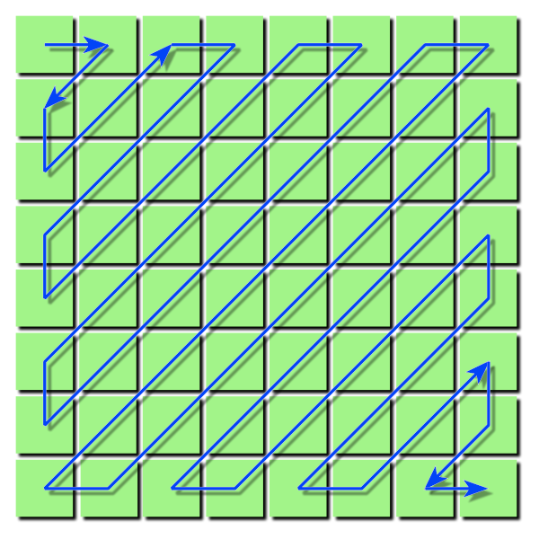
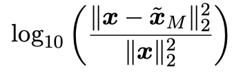
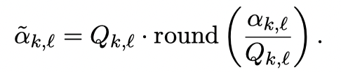
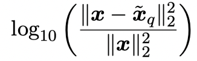
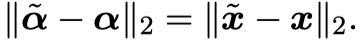
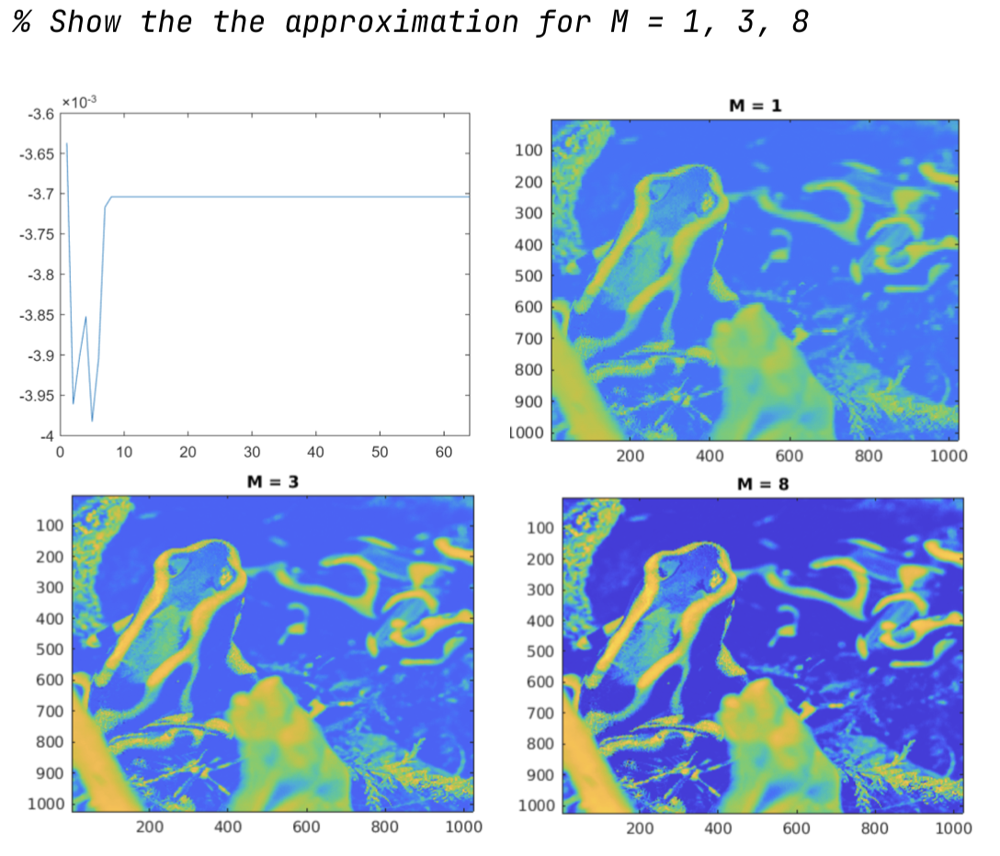
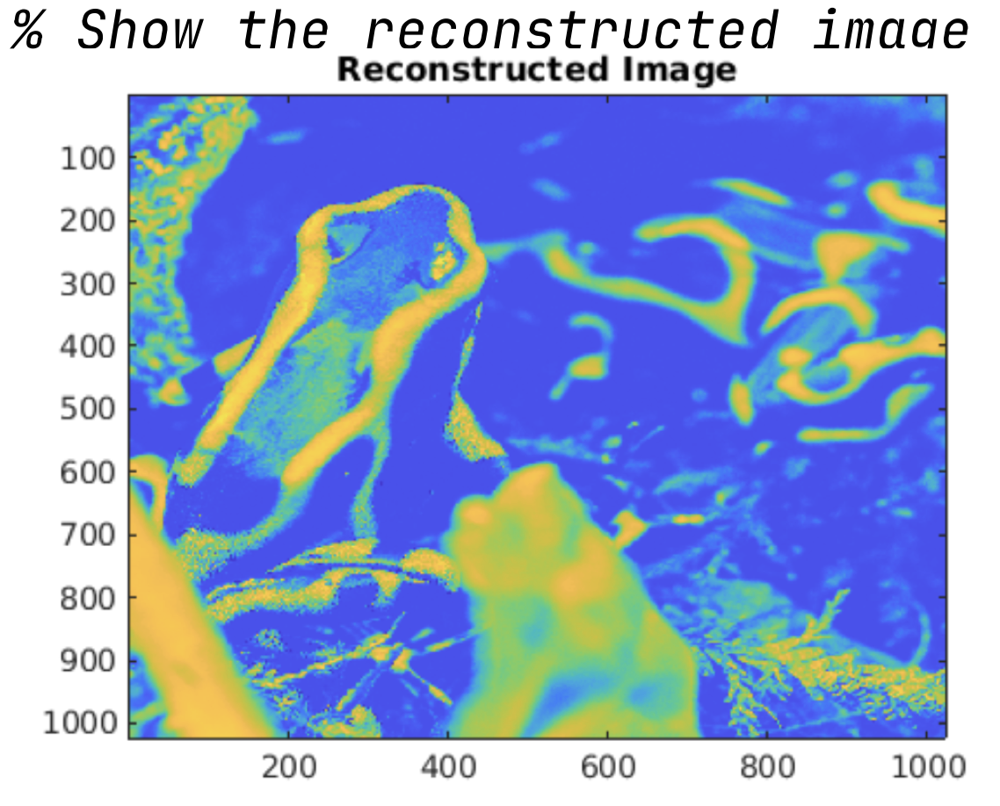
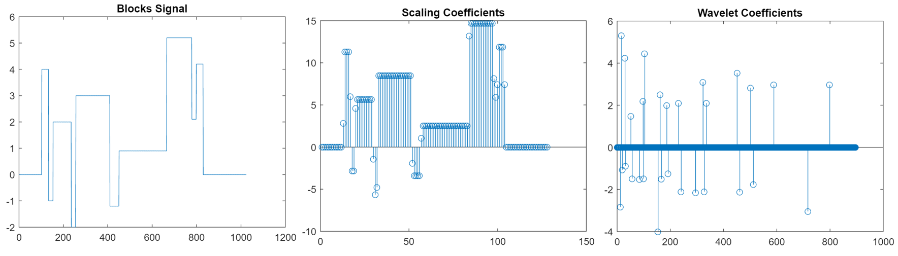
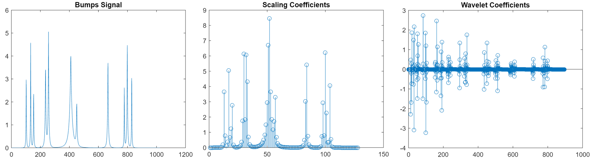

# Project 1: Gramschmidt

## Description

Write a $MATLAB$ function $gramschmidt.m$ that takes a $N ×K $matrix $A$ with $N ≥ K$ and returns an $N × K $matrix $Q$ such that

1. the span of the columns of $Q$ is the same as that for $A$
2. the columns of $Q$ are orthogonal and have unit $\ell_2$ norm.

# Project 2: JPEG Compression Standard

## Description

In this problem, we will explore the main concepts behind the JPEG compression standard.

1. Write a MATLAB function block dct2.m which takes an N × N pixel image, divides it into 8 × 8 pixel blocks (you may assume that N is divisible by 8), and returns the discrete cosine transform coefficients for each block. You will find the MATLAB command dct2.m helpful. Write another MATLAB function iblock dct2.m which is the inverse of the above: that takes the blocked DCT coefficients and returns the image.

2. The provided function jpgzzind.m orders the indexes of a block from low frequencies to high frequencies, as shown below: 

   

   If xb is an 8 × 8 block, then $xb(jpgzzind(8,8))$ is a $64 × 1$ vector containing the same elements, just in the “correct” order. The MATLAB function block $dct2 approx.m$ that takes an $N × N$ approximation $\hat{x}_M$  image and a number $M$, and returns an $N × N$ approximation formed by keeping the first $M$ DCT coefficients in each block.

3. Download the file $frog.tiff$. Read it into MATLAB using x=double(imread(’frog.tiff’)). For this image, plot

   

   versus $M$ (choose a range and number of values of $M$ that make this plot meaningful). Using the $imagesc.m$ command, show the approximation for $M = 1, 3, 8$.

4. Using the quantization table in jpeg Qtable.mat, quantize your transform coefficients using 

   

   Calculate how many of the resulting coefficients are non-zero, and compute

   

   where is the image reconstructed from the quantized coefficients. Verify Parseval by  checking that

   

   Using the $imagesc.m$ command, show the reconstructed image.

## Results:

# Project 3: DCT (Discrete Cosine Transform)

## Description:

Write two MATLAB functions, called mydct.m and myidct.m, that implement the discrete cosine transform (DCT) and its inverse for a vector of length N. 

You code should be short (4 lines or less per function, no loops), efficient (it should make use of the fft command), and match the output of MATLAB’s dct and idct commands. 

You can verify with
$$
x=randn(1000000,1);\newline d1 = mydct(x);\newline d2 = dct(x);\newline norm(d1-d2);\newline

y=randn(1000000,1);\newline w1 = myidct(y);\newline w2 = idct(y);\newline norm(w1-w2)\newline
$$
The norms of the differences should be small in both cases. 

# Project 4: Haar Wavelet Transform

## Description

1. Implement the Haar wavelet transform and its inverse in MATLAB. Do this by writing two MATLAB functions, haar.m and ihaar.m that are called as $w=haar(x,L)$ and $x = ihaar(w,L)$. Here, x is the original signal, and L is the number of levels in the transform.You may assume that the length of $x$ is dyadic; that is, the length of the input is $2^J$ for some positive integer $J$. In this situation, the Haar transform (no matter what $L$ is) will have exactly $2^J$ terms, so the length of $x$ and $w$ should be the same.If we interpret the input $x$ as being scaling coefficients at scale $J$, then the vector $w$ should consist of the scaling coefficients at scale $J − L$ stacked on top of the wavelet coefficients for scale $J − L$ stacked on top of the wavelet coefficients for scale $J − L + 1$, etc.

2. Try your transform out on the data in $blocks.mat$ and $bumps.mat$. For these two inputs, take a Haar wavelet transform with $L = 3$ levels, and plot the scaling coefficients at scale $J − 3$, and the wavelet coefficients at scales $J − 3$ down to $J − 1$. (For both of these signals, $J = 10$.)

## Results

